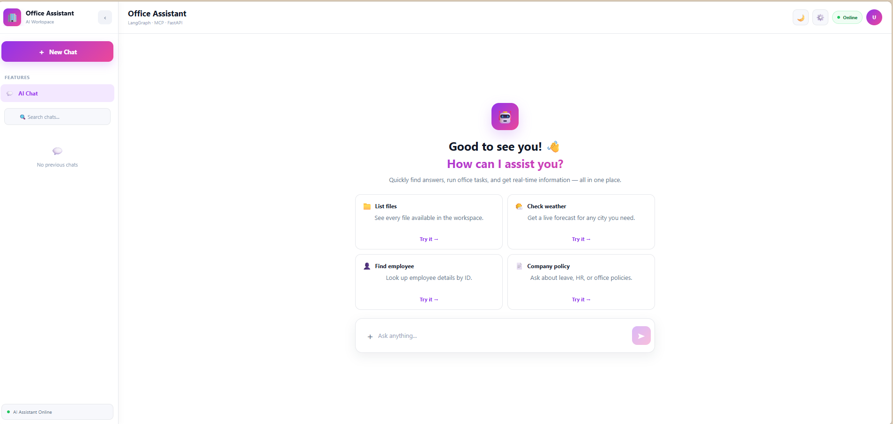
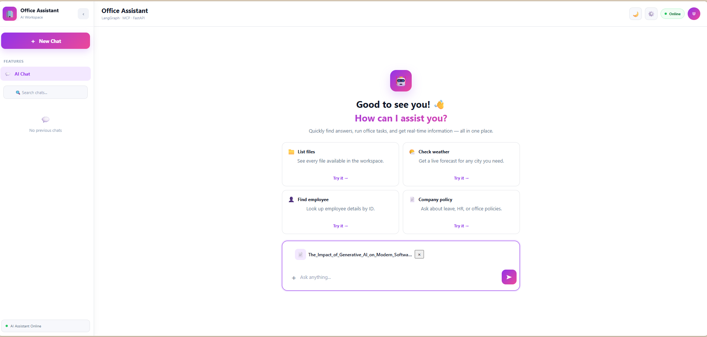
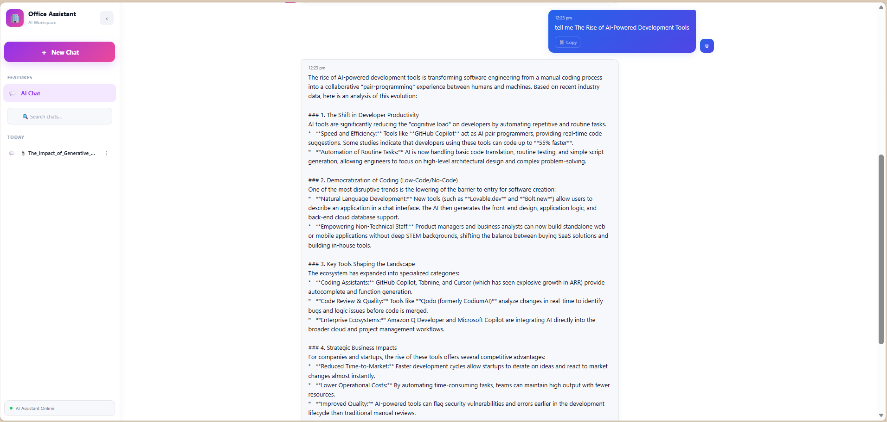
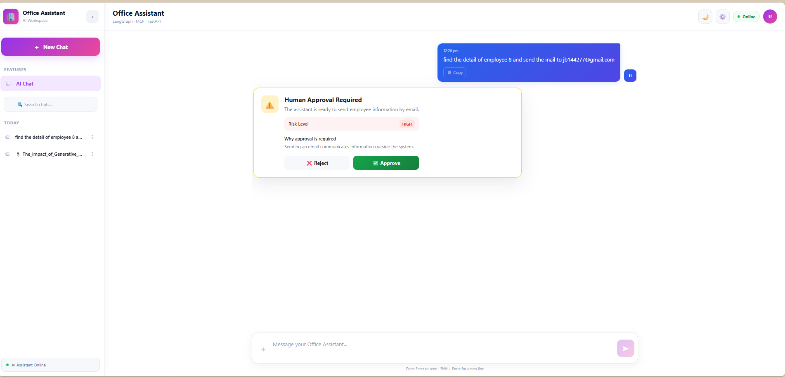
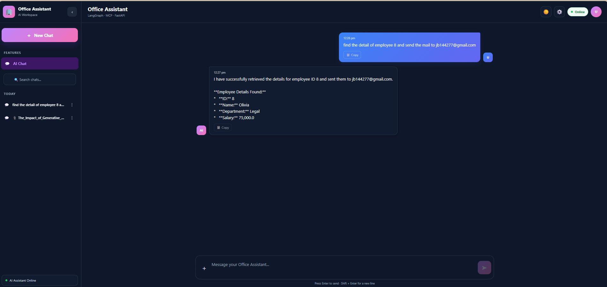

# Office Assistant AI

An AI-powered workplace assistant that combines **React, FastAPI, LangGraph, LangChain, MCP, RAG, Chroma, long-term memory, task automation, risk analysis, guardrails, and human approval** into a single office productivity platform.

The system accepts natural-language requests, determines the required actions, plans and executes tasks through MCP tools, retrieves information from documents, maintains useful conversation memory, evaluates risky operations, and asks for human approval when required.

---

## 🌟 Features

### 🤖 AI Assistant

- Natural-language chat interface
- LangGraph-based agent orchestration
- LangChain tool integration
- Provider-independent LLM architecture
- Support for Ollama and OpenAI
- Structured task planning
- Multi-step task execution
- Context-aware responses

### 🔌 MCP Integration

The application uses six specialized MCP servers:

1. Weather Server
2. Utility Server
3. Communication Server
4. Document Server
5. Database Server
6. Office Server

All six MCP servers are required for the complete application and can be started automatically using:

```powershell
.\start_all.ps1
```

### ⚙️ Task Automation

- Natural-language task planning
- Multiple task execution
- Parallel task execution where possible
- Task dependencies
- Dependency result handling
- Tool argument resolution
- Task result tracking
- Execution status management
- Multi-step workflows

### 🛡️ Risk Analysis & Human Approval

The system evaluates potentially dangerous tool operations before execution.

Risk levels include:

- LOW
- MEDIUM
- HIGH

High-risk operations can require explicit human approval before execution.

Examples include:

- Sending external communication
- Deleting information
- Modifying important records
- Financially consequential operations
- Exposing sensitive information
- Irreversible operations

The approval workflow is integrated with LangGraph and the React frontend.

### 📚 RAG / Document Intelligence

The application provides document-based question answering using Retrieval-Augmented Generation (RAG).

Features include:

- Document loading
- Text splitting
- Embedding generation
- Chroma vector database
- Semantic document retrieval
- Uploaded document processing
- Temporary document usage
- Permanent document storage
- Document upload confirmation

The user can choose whether an uploaded document should be:

- **Saved Permanently**
- **Used Only This Chat**

### 🧠 Long-Term Memory

The assistant includes a memory system for storing and retrieving useful information from previous interactions.

The memory system contains:

- Memory extraction
- Memory storage
- Memory retrieval
- Relevant memory injection into conversations

### 💬 Chat Interface

The React frontend provides:

- Chat interface
- Conversation history
- Thread-based conversations
- File uploads
- Document upload confirmation
- Human approval interface
- Theme support
- Backend API integration

### ⚡ Asynchronous Architecture

The backend uses asynchronous Python components including:

- `asyncio`
- FastAPI
- Async LangChain/LangGraph operations
- Parallel task execution

---

## 🖼️ Screenshots

### Main Chat Interface



### Document Upload



### Document Upload Confirmation


### RAG Document Question Answering



### Human Approval Workflow



### Light / Dark Mode



---

# 🏗️ Architecture

The overall application architecture is:

```text
                         ┌─────────────────────────┐
                         │      React + Vite        │
                         │        Frontend          │
                         │      localhost:5173      │
                         └────────────┬────────────┘
                                      │
                                      │ HTTP
                                      ▼
                         ┌─────────────────────────┐
                         │        FastAPI           │
                         │        Backend           │
                         │      localhost:8080      │
                         └────────────┬────────────┘
                                      │
                                      ▼
                         ┌─────────────────────────┐
                         │        LangGraph         │
                         │    Agent Orchestration   │
                         └────────────┬────────────┘
                                      │
                 ┌────────────────────┼────────────────────┐
                 │                    │                    │
                 ▼                    ▼                    ▼
          ┌──────────────┐     ┌──────────────┐     ┌──────────────┐
          │ MCP Servers  │     │     RAG      │     │    Memory    │
          │              │     │              │     │              │
          │  6 Servers   │     │    Chroma    │     │  Long-Term   │
          │              │     │  Embeddings  │     │    Memory    │
          └──────┬───────┘     └──────────────┘     └──────────────┘
                 │
                 ▼
          ┌─────────────────────────────────────────┐
          │              MCP Tools                  │
          │                                         │
          │ Weather │ Utility │ Communication       │
          │ Document │ Database │ Office            │
          └─────────────────────────────────────────┘
```

---

# 🔌 MCP Architecture

The MCP server layer provides the tools used by the AI agent.

The MCP project is located in:

```text
mcp-server/
```

It contains six independent MCP servers.

## 1. Weather Server

Module:

```powershell
python -m servers.Weather_Server
```

Provides weather-related functionality.

---

## 2. Utility Server

Module:

```powershell
python -m servers.Utility_Server
```

Provides general utility functionality such as calculations and utility operations.

---

## 3. Communication Server

Module:

```powershell
python -m servers.Communication_Server
```

Provides communication-related functionality such as email operations.

---

## 4. Document Server

Module:

```powershell
python -m servers.Document_Server
```

Provides document-related operations.

---

## 5. Database Server

Module:

```powershell
python -m servers.Database_Server
```

Provides database-related operations.

---

## 6. Office Server

Module:

```powershell
python -m servers.Office_Server
```

Provides office-related functionality and office tools.

---

# 🧩 MCP Tools

The MCP layer contains specialized tools for different office operations.

Examples include:

- Calculator operations
- Database operations
- Email operations
- Excel reading
- File operations
- Folder operations
- Notes
- PDF reading
- Prompt handling
- Report generation
- Resource handling
- Searching
- System operations
- Weather operations

Tools are organized under:

```text
mcp-server/tools/
```

---

# 🛠️ Technology Stack

## Backend

| Technology | Purpose |
| --- | --- |
| Python 3.11+ | Backend programming language |
| FastAPI | REST API |
| LangGraph | Agent orchestration |
| LangChain | LLM and tool integration |
| Pydantic | Data validation |
| asyncio | Asynchronous execution |
| SQLite | Local database support |
| Chroma | Vector database |
| Guardrails AI | AI output validation |

## LLM Providers

The project supports:

- Ollama
- OpenAI

The LLM provider configuration is isolated in:

```text
backend/app/agent.py
```

The goal is to allow the provider to be changed without modifying the rest of the agent architecture.

## Embeddings

Ollama embeddings:

```text
nomic-embed-text
```

OpenAI embeddings:

```text
text-embedding-3-small
```

## Frontend

| Technology | Purpose |
| --- | --- |
| React | User interface |
| Vite | Development/build tool |
| JavaScript | Frontend programming language |
| CSS | UI styling |

## MCP

The project uses MCP servers to expose specialized office capabilities to the backend agent.

---

# 📁 Project Structure

```text
office-assistant-ai/
│
├── backend/
│   ├── app/
│   │   ├── agents/
│   │   │   ├── employee_agent.py
│   │   │   ├── supervisor.py
│   │   │   └── __init__.py
│   │   │
│   │   ├── rag/
│   │   │   ├── context.py
│   │   │   ├── loader.py
│   │   │   ├── retriever.py
│   │   │   ├── splitter.py
│   │   │   ├── tools.py
│   │   │   ├── vector_store.py
│   │   │   └── __init__.py
│   │   │
│   │   ├── agent.py
│   │   ├── api.py
│   │   ├── chat_history.py
│   │   ├── client.py
│   │   ├── graph.py
│   │   ├── guardrails.py
│   │   ├── guardrails_ai.py
│   │   ├── main.py
│   │   ├── memory.py
│   │   ├── memory_extractor.py
│   │   ├── memory_retriever.py
│   │   ├── memory_store.py
│   │   ├── nodes.py
│   │   ├── parallel_executor.py
│   │   ├── risk.py
│   │   ├── safe_tool_node.py
│   │   ├── schemas.py
│   │   ├── state.py
│   │   ├── task_executor.py
│   │   └── tools.py
│   │
│   ├── documents/
│   ├── test/
│   └── requirements.txt
│
├── frontend/
│   ├── public/
│   ├── src/
│   │   ├── assets/
│   │   ├── App.jsx
│   │   ├── App.css
│   │   ├── index.css
│   │   └── main.jsx
│   │
│   ├── package.json
│   └── package-lock.json
│
├── mcp-server/
│   ├── core/
│   │   ├── auth.py
│   │   └── message.py
│   │
│   ├── files/
│   │   ├── company_policy.txt
│   │   ├── meeting.txt
│   │   ├── notes.txt
│   │   ├── todos.txt
│   │   └── Projects/
│   │
│   ├── prompts/
│   │   ├── professional_email.md
│   │   └── report.md
│   │
│   ├── servers/
│   │   ├── Communication_Server.py
│   │   ├── Database_Server.py
│   │   ├── Document_Server.py
│   │   ├── Office_Server.py
│   │   ├── Utility_Server.py
│   │   └── Weather_Server.py
│   │
│   ├── tools/
│   │   ├── calculator_tools.py
│   │   ├── database_tools.py
│   │   ├── email_tools.py
│   │   ├── excel_reader.py
│   │   ├── file_tools.py
│   │   ├── folder_tools.py
│   │   ├── notes_tools.py
│   │   ├── pdf_reader.py
│   │   ├── prompt_tools.py
│   │   ├── report_tools.py
│   │   ├── resource_tools.py
│   │   ├── search_tools.py
│   │   ├── system_tools.py
│   │   └── weather_tools.py
│   │
│   └── requirements.txt
│
├── screenshots/
│   ├── approval-workflow.png
│   ├── document-upload-conformation.png
│   ├── document-upload.png
│   ├── light-dark-mode.png
│   ├── main-chat.png
│   └── rag-answer.png
│
├── start_all.ps1
├── .gitignore
└── README.md
```

> `.venv`, `node_modules`, environment files, databases, runtime data, logs, uploads, and generated vector data should not be committed to Git.

---

# 📋 Prerequisites

Install the following before running the project:

- Python 3.11 or newer
- Node.js
- npm
- Git
- Ollama, if using Ollama
- PowerShell on Windows

Check Python:

```powershell
python --version
```

Check Node.js:

```powershell
node --version
```

Check npm:

```powershell
npm --version
```

Check Git:

```powershell
git --version
```

If using Ollama:

```powershell
ollama --version
```

---

# 🚀 Installation

## 1. Clone the Repository

```powershell
git clone https://github.com/ujjwalprajapatinareshbhai/office-assistant-ai.git

cd office-assistant-ai
```

---

# 🐍 2. Backend Setup

Open PowerShell in the project root.

Move into the backend:

```powershell
cd backend
```

Create the backend virtual environment:

```powershell
python -m venv .venv
```

Activate it:

```powershell
.\.venv\Scripts\Activate.ps1
```

Install dependencies:

```powershell
pip install -r requirements.txt
```

Return to the project root:

```powershell
cd ..
```

---

# 🔌 3. MCP Server Setup

Move into the MCP server:

```powershell
cd mcp-server
```

Create the MCP virtual environment:

```powershell
python -m venv .venv
```

Activate it:

```powershell
.\.venv\Scripts\Activate.ps1
```

Install MCP dependencies:

```powershell
pip install -r requirements.txt
```

Return to the project root:

```powershell
cd ..
```

---

# ⚛️ 4. Frontend Setup

Move into the frontend:

```powershell
cd frontend
```

Install Node dependencies:

```powershell
npm install
```

Return to the project root:

```powershell
cd ..
```

---

# 🔐 5. Environment Configuration

Create the required environment files locally.

For example:

```text
backend/.env
```

Do **not** commit `.env` files to GitHub.

A typical Ollama configuration may look like:

```env
LLM_PROVIDER=ollama
OLLAMA_MODEL=<your-ollama-chat-model>
OLLAMA_EMBEDDING_MODEL=nomic-embed-text
OLLAMA_NUM_PREDICT=4096
OLLAMA_NUM_CTX=16384
OLLAMA_KEEP_ALIVE=30m
```

For OpenAI, configure the provider and required credentials according to the project's environment configuration.

Example:

```env
LLM_PROVIDER=openai
OPENAI_MODEL=<your-openai-model>
OPENAI_EMBEDDING_MODEL=text-embedding-3-small
OPENAI_API_KEY=<your-api-key>
```

> Never commit API keys, passwords, tokens, or other secrets to GitHub.

---

# 🤖 6. Ollama Setup

If using Ollama, make sure the Ollama application/service is running.

Check installed models:

```powershell
ollama list
```

Install the embedding model if necessary:

```powershell
ollama pull nomic-embed-text
```

Make sure the chat model configured in your environment is also available.

---

# ▶️ Running the Application

The recommended way to run the complete application is:

```powershell
.\start_all.ps1
```

The startup sequence is:

```text
6 MCP Servers
      ↓
FastAPI Backend
      ↓
React Frontend
```

All six MCP servers must remain running because the backend depends on the MCP layer to access the available tools.

---

# 🚀 start_all.ps1

The project includes:

```text
start_all.ps1
```

This PowerShell script starts the complete development environment.

It starts:

### 1. Weather MCP Server

```powershell
python -m servers.Weather_Server
```

### 2. Utility MCP Server

```powershell
python -m servers.Utility_Server
```

### 3. Communication MCP Server

```powershell
python -m servers.Communication_Server
```

### 4. Document MCP Server

```powershell
python -m servers.Document_Server
```

### 5. Database MCP Server

```powershell
python -m servers.Database_Server
```

### 6. Office MCP Server

```powershell
python -m servers.Office_Server
```

After the MCP servers are started, the backend is started with:

```powershell
uvicorn app.api:app --reload --port 8080
```

Finally, the frontend is started with:

```powershell
npm run dev
```

---

# 🖥️ Manual Startup

If you want to start the services manually, use separate PowerShell terminals.

## Terminal 1 — Weather MCP

```powershell
cd D:\office-assistant-ai\mcp-server

.\.venv\Scripts\Activate.ps1

python -m servers.Weather_Server
```

Keep this terminal running.

---

## Terminal 2 — Utility MCP

```powershell
cd D:\office-assistant-ai\mcp-server

.\.venv\Scripts\Activate.ps1

python -m servers.Utility_Server
```

Keep this terminal running.

---

## Terminal 3 — Communication MCP

```powershell
cd D:\office-assistant-ai\mcp-server

.\.venv\Scripts\Activate.ps1

python -m servers.Communication_Server
```

Keep this terminal running.

---

## Terminal 4 — Document MCP

```powershell
cd D:\office-assistant-ai\mcp-server

.\.venv\Scripts\Activate.ps1

python -m servers.Document_Server
```

Keep this terminal running.

---

## Terminal 5 — Database MCP

```powershell
cd D:\office-assistant-ai\mcp-server

.\.venv\Scripts\Activate.ps1

python -m servers.Database_Server
```

Keep this terminal running.

---

## Terminal 6 — Office MCP

```powershell
cd D:\office-assistant-ai\mcp-server

.\.venv\Scripts\Activate.ps1

python -m servers.Office_Server
```

Keep this terminal running.

---

## Terminal 7 — Backend

```powershell
cd D:\office-assistant-ai\backend

.\.venv\Scripts\Activate.ps1

uvicorn app.api:app --reload --port 8080
```

---

## Terminal 8 — Frontend

```powershell
cd D:\office-assistant-ai\frontend

npm run dev
```

Then open:

```text
http://localhost:5173
```

---

# 🌐 Application URLs

| Service | URL |
| --- | --- |
| Frontend | http://localhost:5173 |
| Backend | http://localhost:8080 |
| FastAPI Swagger | http://localhost:8080/docs |
| OpenAPI | http://localhost:8080/openapi.json |

---

# 🔄 Application Request Flow

A typical request flows through the system as follows:

```text
User
 │
 ▼
React Frontend
 │
 ▼
FastAPI API
 │
 ▼
LangGraph
 │
 ├──────────────► Memory Retrieval
 │
 ├──────────────► RAG Retrieval
 │
 ▼
Supervisor
 │
 ▼
Task Planning
 │
 ▼
Risk Analysis
 │
 ├── LOW ─────────► Execute
 │
 ├── MEDIUM ──────► Execute according to policy
 │
 └── HIGH ────────► Human Approval
                         │
                         ▼
                    Execute Task
                         │
                         ▼
                    MCP Server
                         │
                         ▼
                     MCP Tool
                         │
                         ▼
                    Task Result
                         │
                         ▼
                   Final AI Response
                         │
                         ▼
                    React Frontend
```

---

# 🧠 LLM Provider Architecture

The provider-specific configuration is isolated in:

```text
backend/app/agent.py
```

The provider is selected using environment configuration.

For Ollama:

```env
LLM_PROVIDER=ollama
```

For OpenAI:

```env
LLM_PROVIDER=openai
```

The architecture is designed to keep provider-specific configuration isolated so that changing the LLM provider does not require rewriting the supervisor, task executor, graph, API, or other application components.

---

# 📚 RAG Architecture

The RAG pipeline follows:

```text
Document
   │
   ▼
Document Loader
   │
   ▼
Text Splitter
   │
   ▼
Embeddings
   │
   ▼
Chroma Vector Store
   │
   ▼
Retriever
   │
   ▼
Relevant Context
   │
   ▼
AI Response
```

RAG implementation is located under:

```text
backend/app/rag/
```

Important modules include:

```text
loader.py
splitter.py
vector_store.py
retriever.py
context.py
tools.py
```

---

# 🧠 Long-Term Memory

The memory system allows the assistant to retain useful information across conversations.

The memory flow is:

```text
Conversation
     │
     ▼
Memory Extraction
     │
     ▼
Memory Store
     │
     ▼
Future Conversation
     │
     ▼
Memory Retrieval
     │
     ▼
Relevant Memory Context
     │
     ▼
AI Response
```

Memory-related modules include:

```text
memory.py
memory_extractor.py
memory_retriever.py
memory_store.py
```

---

# 🛡️ Safety Architecture

The assistant contains multiple safety mechanisms.

## Risk Analysis

Tool operations can be classified into:

```text
LOW
MEDIUM
HIGH
```

Potentially high-risk operations include:

- External communication
- Data deletion
- Important record modification
- Financial actions
- Sensitive information exposure
- Irreversible actions

---

# 👤 Human Approval

When a task requires approval, execution can pause until the user makes a decision.

```text
User Request
    │
    ▼
Task Planning
    │
    ▼
Risk Analysis
    │
    ▼
HIGH RISK
    │
    ▼
Human Approval
    │
    ├── Approved ──► Execute
    │
    └── Rejected ──► Stop
```

The React frontend displays the approval request and sends the user's decision back to the backend.

---

# 📄 Document Upload Confirmation

Uploaded documents do not have to become part of the permanent knowledge base immediately.

The user can choose:

```text
Save Permanently
```

or:

```text
Use Only This Chat
```

This provides control over whether uploaded documents become permanently available to the RAG system.

---

# 🧪 Testing

Backend tests are located under:

```text
backend/test/
```

If the project contains pytest-compatible tests, run:

```powershell
cd backend

python -m pytest
```

Individual test modules can also be executed directly when required.

---

# 🔍 API Documentation

Once the backend is running, FastAPI provides interactive API documentation.

Open:

```text
http://localhost:8080/docs
```

The OpenAPI specification is available at:

```text
http://localhost:8080/openapi.json
```

---

# 🛑 Stopping the Application

When using `start_all.ps1`, the services are started in separate processes/windows according to the startup script.

To stop a running service, use:

```text
Ctrl + C
```

in its corresponding terminal/window.

When shutting down the development environment, make sure all six MCP servers and the backend/frontend processes are stopped.

---

# 🐛 Troubleshooting

## MCP Server Does Not Start

First make sure you are using the MCP virtual environment:

```powershell
cd mcp-server

.\.venv\Scripts\Activate.ps1
```

Test an individual MCP server:

```powershell
python -m servers.Weather_Server
```

If the server starts manually but does not start through `start_all.ps1`, verify that the script is being executed from the repository root:

```text
D:\office-assistant-ai
```

---

## One MCP Server Stops

The backend depends on the MCP layer.

Check the terminal/window for the MCP server that stopped and look at the error message.

For example:

```powershell
python -m servers.Database_Server
```

Run the failing server manually to identify the problem.

---

## Backend Does Not Start

Activate the backend environment:

```powershell
cd backend

.\.venv\Scripts\Activate.ps1
```

Start FastAPI manually:

```powershell
uvicorn app.api:app --reload --port 8080
```

Then check:

```text
http://localhost:8080/docs
```

---

## Frontend Does Not Start

Go to the frontend:

```powershell
cd frontend
```

Install dependencies:

```powershell
npm install
```

Then start the development server:

```powershell
npm run dev
```

---

## Port 8080 Already in Use

Check which process is using port 8080:

```powershell
netstat -ano | findstr :8080
```

Stop the process if necessary and restart the backend.

---

## Port 5173 Already in Use

Check:

```powershell
netstat -ano | findstr :5173
```

Stop the conflicting process if necessary.

---

## Ollama Problems

Check Ollama:

```powershell
ollama list
```

Make sure the configured chat model is available.

For embeddings:

```powershell
ollama list
```

Make sure:

```text
nomic-embed-text
```

is installed.

If required:

```powershell
ollama pull nomic-embed-text
```

---

## Chroma / Embedding Problems

If document retrieval fails:

1. Confirm Ollama is running.
2. Confirm the embedding model is installed.
3. Confirm the configured embedding model matches the application configuration.
4. Check the backend terminal for the exact error.
5. Rebuild the local vector data only when necessary.

The local Chroma data is ignored by Git and should normally remain a local runtime resource.

---

# 🔐 Security

Never commit sensitive information to GitHub.

The `.gitignore` intentionally excludes:

```text
.env
.env.*
.venv/
node_modules/
*.db
*.db-shm
*.db-wal
chroma_db/
uploads/
pending_uploads/
*.log
logs/
```

Do not commit:

- API keys
- Passwords
- Authentication tokens
- Private credentials
- Production secrets
- Personal information
- Private documents

Use environment variables and local configuration for sensitive information.

---

# 📦 Git Workflow

Check repository status:

```powershell
git status
```

Stage changes:

```powershell
git add .
```

Create a commit:

```powershell
git commit -m "Update Office Assistant AI"
```

Push changes:

```powershell
git push
```

---

# 🆕 First GitHub Push

If this is the first push to the GitHub repository:

```powershell
git branch -M main

git remote add origin https://github.com/ujjwalprajapatinareshbhai/office-assistant-ai.git

git push -u origin main
```

If the remote is already configured, do not run `git remote add origin` again. Simply use:

```powershell
git push -u origin main
```

---

# 🗺️ Roadmap

Possible future improvements:

- [ ] Production deployment
- [ ] Docker support
- [ ] MCP health monitoring
- [ ] Automatic MCP server restart
- [ ] Authentication and user accounts
- [ ] Role-based access control
- [ ] Improved observability
- [ ] Streaming responses
- [ ] More document formats
- [ ] Advanced document management
- [ ] Better task scheduling
- [ ] Multi-user memory isolation
- [ ] Production database support
- [ ] Cloud deployment
- [ ] Automated CI/CD
- [ ] Improved automated test coverage

---

# 🤝 Contributing

Contributions are welcome.

## 1. Fork the repository

Create your own fork on GitHub.

## 2. Create a feature branch

```powershell
git checkout -b feature/my-feature
```

## 3. Make your changes

Implement and test your changes.

## 4. Commit your changes

```powershell
git add .

git commit -m "Add my feature"
```

## 5. Push your branch

```powershell
git push origin feature/my-feature
```

## 6. Open a Pull Request

Create a Pull Request on GitHub describing your changes.

---

# 📄 License

This project currently does not specify a license.

If you want others to freely use, modify, and distribute the project, add an appropriate license such as the MIT License.

For an MIT-licensed project, create:

```text
LICENSE
```

and add the complete MIT License text.

---

# ⭐ Quick Start

After completing the initial installation and configuration:

```powershell
cd office-assistant-ai

.\start_all.ps1
```

The script starts:

```text
Weather MCP
Utility MCP
Communication MCP
Document MCP
Database MCP
Office MCP
       │
       ▼
FastAPI Backend
       │
       ▼
React Frontend
```

Open the frontend:

```text
http://localhost:5173
```

FastAPI documentation:

```text
http://localhost:8080/docs
```

---

# 🏢 Project Summary

**Office Assistant AI** is an intelligent workplace automation platform built using:

```text
React
   +
FastAPI
   +
LangGraph
   +
LangChain
   +
MCP
   +
RAG
   +
Chroma
   +
Ollama / OpenAI
   +
Long-Term Memory
   +
Guardrails
   +
Risk Analysis
   +
Human Approval
```

The project demonstrates how modern AI agent architecture can be combined with MCP-based tools, document retrieval, memory, safety controls, and a web interface to build an extensible office automation assistant.

---

**Version:** 1.0.0

**Last Updated:** September 2026
